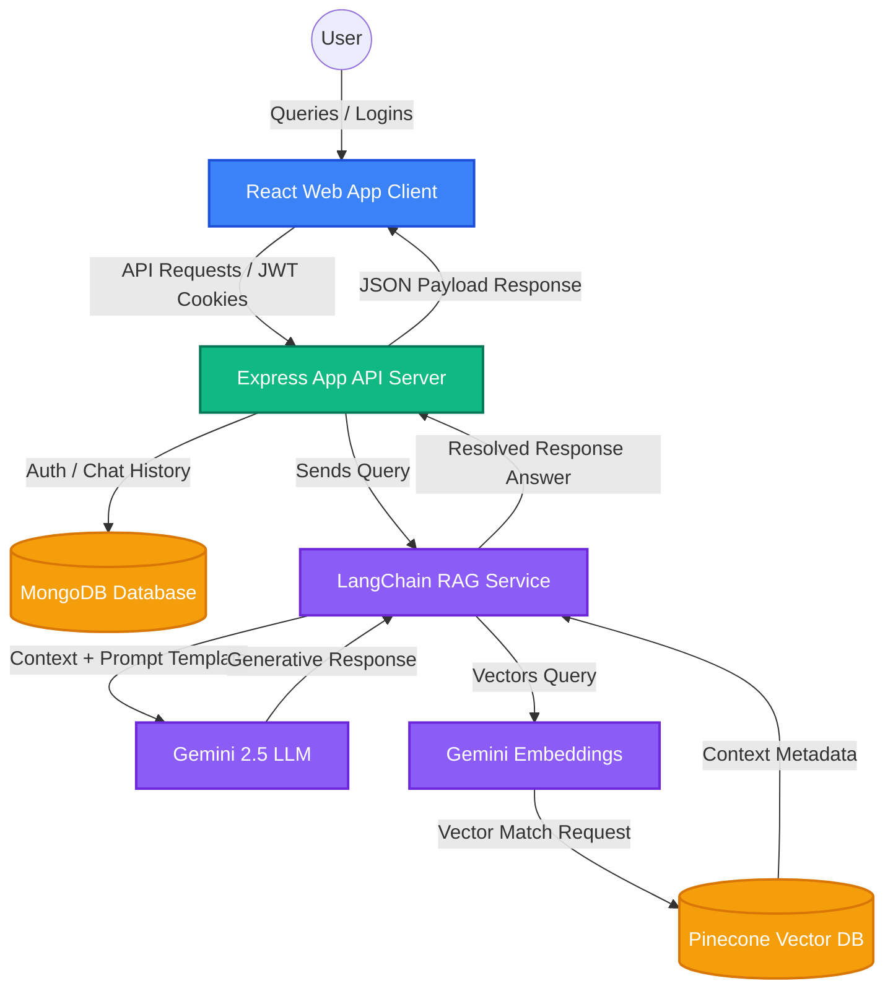

# VANI: Maritime RAG AI Companion

`ASK_ME` is a premium, high-performance **Retrieval-Augmented Generation (RAG)** platform designed specifically for maritime professionals, sailors, and merchant navy officers. It enables users to instantly query complex shipping manuals, safety protocols, maritime regulations, and merchant navy documentation via a modern web interface.

The system utilizes **Gemini** models for advanced natural language understanding and **Pinecone Vector Database** for fast, contextually accurate vector searches, backed by a Node.js/Express REST server and MongoDB for session records.

---

## ⚓ Features

- **Intelligent Maritime RAG Pipeline**: Combines Pinecone Vector DB with Google's `gemini-2.5-flash` model and `gemini-embedding-001` (or `text-embedding-004`) to provide accurate answers sourced *only* from verified maritime documents and shipping manuals.
- **Secure Authentication**: Includes JWT-based session security, bcrypt password hashing, and inputs hardened against NoSQL injection vectors.
- **PDF Ingestion & Indexing**: Automatically processes, splits, embeds, and uploads maritime manuals/protocols directly into a vector space index.
- **Session & Chat Log History**: Saves and updates multi-turn conversation threads in MongoDB with pagination, search, and delete controls.
- **Dynamic Compliance Gatekeeping**: Features an interactive compliance portal consent flow for deck/engine officers with session tracking and permanent database muting preferences.
- **Premium Responsive UI**: A visually stunning dark-mode/glassmorphic web dashboard built using React, Tailwind CSS, Framer Motion, and GSAP micro-animations.

---

## 🚢 Example Maritime Queries

The application is pre-configured with quick-access maritime prompts to test and query:
- *What is the role of the Master and why is their authority absolute?*
- *Why is the rudder critical and how does the steering gear move it?*
- *What is the purpose of bottom paint (antifouling)?*
- *What is "Scope" in anchoring and why does it matter?*
- *Why do we use "Port" and "Starboard" instead of "Left" and "Right"?*
- *What does "Roger" mean in radio communication?*
- *What is the role of the Boatswain in the deck department?*

---

## System Architecture

The following diagram outlines the system architecture and data flows:



---

## Directory Structure

The workspace is organized into a clean decoupled backend/frontend monorepo pattern:

```text
ASK_ME/
├── backend/                         # SERVER-SIDE LAYER (Node.js / Express)
│   ├── src/
│   │   ├── config/                  # Third-party configurations & connection keys
│   │   │   ├── db.js                # MongoDB Mongoose connection client
│   │   │   └── gemini.js            # Gemini LLM & Text Embedding instantiation
│   │   ├── models/                  # Operational Mongoose Database Schemas
│   │   │   ├── UserModel.js         # Schema for Officers, Staff, and Administrators
│   │   │   └── ChatHistory.js       # Stores chat memory sessions for context recall
│   │   ├── controllers/             # Request Controllers (Validates payload data)
│   │   │   ├── auth.controller.js   # Logic for staff onboarding and login
│   │   │   ├── chat.controller.js   # Logic for messaging, logs, search, deletion
│   │   │   └── system.controller.js # Logic for compliance configs and status indicators
│   │   ├── routes/                  # Express Routing Configurations
│   │   │   ├── auth.routes.js       # /api/auth/* (register, login, settings)
│   │   │   ├── chat.routes.js       # /api/chat/* (message, history, deletion)
│   │   │   └── system.routes.js     # /api/system/* (compliance config settings)
│   │   ├── middleware/              # Security and Error Traps
│   │   │   ├── auth.middleware.js   # Intercepts routes to validate JWT keys
│   │   │   └── error.middleware.js  # Global failure catcher
│   │   ├── rag/                     # CORE RAG AI PIPELINE (LangChain)
│   │   │   ├── indexing.js          # Ingestion runner loading PDFs to Pinecone
│   │   │   └── query.js             # Semantic search & response compilation
│   │   └── app.js                   # Express application setup (CORS, Parsers)
│   ├── .env                         # Server environment variables (Secret keys)
│   ├── package.json                 # Backend dependency registry
│   └── server.js                    # Core entry point (Listens on port)
│
├── frontend/                        # CLIENT-SIDE LAYER (React.js + Tailwind CSS)
│   ├── public/                      # Static assets & favicon badges
│   ├── src/
│   │   ├── assets/                  # Tailwind stylesheet base
│   │   ├── components/              # Reusable Presentation UI Elements
│   │   │   ├── Layout/              # Sidebar, Navbar, and Dashboard layouts
│   │   │   ├── Chat/                # ChatBox, Message bubbles, and Compliance Modal
│   │   │   └── Upload/              # Ingestion file drops
│   │   ├── context/                 # Global UI State Managers
│   │   │   ├── AuthContext.jsx      # Persists authentication tokens
│   │   │   └── ChatContext.jsx      # Holds current conversation state safely
│   │   ├── config/                  # Client environment integrations
│   │   ├── services/                # API Client Interface (Axios central configurations)
│   │   ├── views/                   # Full Screen Views (Login, Chat, Profile, Settings)
│   │   ├── App.jsx                  # Main component defining React Router paths
│   │   └── main.jsx                 # Vite application entry anchor
│   ├── .env                         # Public application environment variables
│   ├── package.json                 # Frontend dependency registry
│   ├── tailwind.config.js           # Tailwind v4 configuration file
│   └── vite.config.js               # Vite compilation configurations
```

---

## Tech Stack

### Frontend
* **React 18 + Vite**: High-performance UI loading and rapid build compilation.
* **Tailwind CSS v4**: Modular styling engine for rapid utility layouts.
* **Framer Motion & GSAP**: Fluid animations, transitions, and hover-triggered micro-interactions.
* **React Router DOM v6**: Nested routes for seamless dashboard view swapping.
* **React Icons & Axios**: Visual styling assets and client-side HTTP communication.

### Backend
* **Node.js + Express**: Scalable event-driven web routing API backend.
* **Mongoose + MongoDB**: Scalable Document Database storage for logs and user state profiles.
* **BcryptJS & JWT**: Secure session validation and password hashing strategies.

### Artificial Intelligence & RAG
* **LangChain Engine**: Orchestrates prompts, splitters, chains, and vector store connectors.
* **Google Generative AI**: Instantiates `gemini-2.5-flash` model and `gemini-embedding-001`.
* **Pinecone Database**: Cloud vector database providing ultra-fast similarity searches.

---

## Setup & Installation

Follow these steps to configure and boot the application locally.

### Prerequisites
- Node.js installed (v18+ recommended)
- A MongoDB cluster or a local MongoDB database instance running.
- A Pinecone account and a created Vector Index (using `768` dimensions for `gemini-embedding-001`).
- A Gemini Developer API Key.

---

### Step 1: Clone the Repository
```bash
git clone <repository-url>
cd ASK_ME
```

---

### Step 2: Configure the Backend Server

1. Navigate to the backend directory:
   ```bash
   cd backend
   ```
2. Install dependencies:
   ```bash
   npm install
   ```
3. Create a `.env` file in the root of the `backend/` directory and add the following keys:
   ```env
   PORT=4000
   MONGODB_URL=mongodb+srv://<username>:<password>@cluster.mongodb.net/askme
   JWT_SECRET=your_jwt_secret_phrase
   FRONTEND_URL=http://localhost:5173
   GEMINI_API_KEY=your_gemini_api_key
   PINECONE_API_KEY=your_pinecone_api_key
   PINECONE_INDEX_NAME=pdf-indexing
   ```
4. Start the backend in development mode:
   ```bash
   npm run dev
   ```
   *The server will boot on [http://localhost:4000](http://localhost:4000)*

---

### Step 3: Populate Context / Indexing PDFs

Before using the chat interface, load your maritime PDFs into Pinecone:

1. Place your target `.pdf` shipping manuals (e.g. `VANI_DATA.pdf`) inside the `backend/src/rag/` folder.
2. Edit the pdf loader path `PDF_PATH` inside [indexing.js](file:///c:/Users/sharm/OneDrive/Desktop/ASK_ME/backend/src/rag/indexing.js#L68):
   ```javascript
   const PDF_PATH = path.resolve(__dirname, './VANI_DATA.pdf');
   ```
3. Run the indexing script to clear the old index and upload the documents to Pinecone:
   ```bash
   node src/rag/indexing.js
   ```

---

### Step 4: Configure the Frontend Client

1. Open a new terminal and navigate to the frontend directory:
   ```bash
   cd ../frontend
   ```
2. Install dependencies:
   ```bash
   npm install
   ```
3. Create a `.env` file in the root of the `frontend/` directory and configure the environment variables:
   ```env
   VITE_API_BASE=http://localhost:4000/api
   VITE_ROUTE_LOGIN=/
   VITE_ROUTE_REGISTER=/register
   VITE_ROUTE_CHAT=/chat
   VITE_POST_LOGIN_PATH=/chat
   VITE_AUTO_REDIRECT_AUTHENTICATED=true
   ```
4. Run the Vite development server:
   ```bash
   npm run dev
   ```
   *The application client will boot on [http://localhost:5173](http://localhost:5173)*

---

## API Reference endpoints

### Authentication (`/api/auth`)
* `POST /register` - Register a new maritime officer profile.
* `POST /login` - Sign in and receive a JSON Web Token cookie.
* `POST /logout` - Clear cookies and terminate current session.
* `PATCH /update-settings/:id` - Configure preferences (e.g. `hasMutedCompliance` states).
* `PATCH /mute-compliance/:id` - Mark compliance warning disclaimer modal as muted.

### Chat Logs (`/api/chat`)
* `POST /message` - Send a message query to search Pinecone vectors and stream back response answers from Gemini.
* `GET /history` - List paginated conversation threads containing a user's logs history.
* `GET /history/:id` - Fetch message records belonging to a specific conversation ID.
* `DELETE /history/:id` - Delete a single conversation thread.
* `DELETE /history` - Wipe out all chat log conversations associated with the user profile.

### System Configuration (`/api/system`)
* `GET /compliance-config` - Access current application parameters and settings dynamically.

---

## Security & Injection Safeguards

1. **NoSQL Query Injection Prevention**: All queries made against user profiles use strict `$eq` matching and character sanitization regex rules to prevent nested command objects from executing.
2. **Strict Payload Validations**: Strict length boundaries are checked on name, email, and password properties prior to hitting DB operations.
3. **Session Cookie Isolation**: Auth tokens are stored inside HTTP-Only secure cookies to block cross-site scripting (XSS) extraction.
